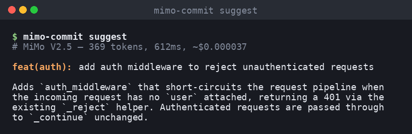
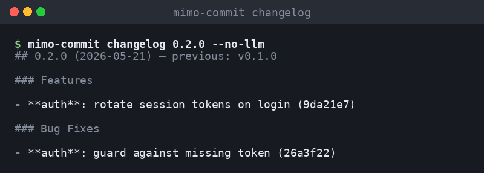
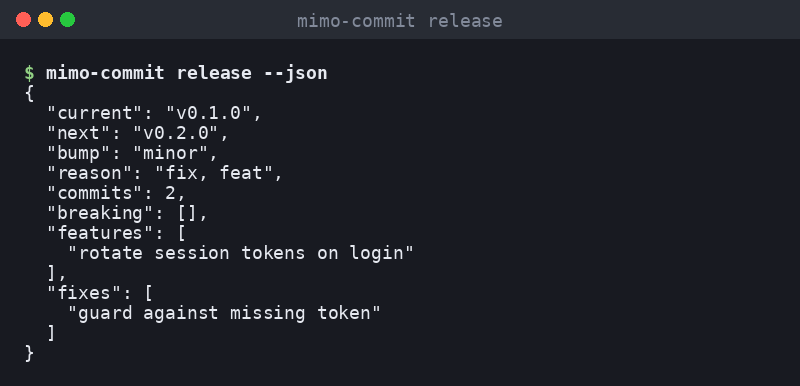

# MiMo Commit Genius

> **An end-to-end, AI-native git workflow for teams that ship fast — powered by Xiaomi MiMo V2.5.**
>
> Auto-generates Conventional Commit messages from your staged diff, derives release changelogs from your history, and proposes the next semantic version — all from one fast, cheap, batteries-included CLI.




---

## TL;DR

Developers spend cumulative *hours* per week writing (and bike-painting) git commit messages. The output is usually inconsistent, frequently useless for changelog generation, and almost never machine-readable. Existing AI tools fix this but at frontier-model prices ($0.03–$0.10 per commit), which gets prohibitive across a team at scale.

**MiMo Commit Genius** is a single, focused Python CLI that:

1. Reads the diff you just staged with `git add`,
2. Asks Xiaomi's MiMo V2.5 model — a code-tuned LLM that's roughly 600–2000× cheaper than GPT-4/Claude — what actually changed,
3. Validates the model's reply against the **Conventional Commits v1.0.0** spec,
4. Drops the result into `.git/COMMIT_EDITMSG` via a standard `prepare-commit-msg` hook, so `git commit` Just Works,
5. Reuses the same parser to *also* generate beautiful release changelogs and compute the next semver bump from your tag history.

No SaaS dashboard. No webhooks. No GitHub App. Just one `pip install`, one git hook, and the rest of your workflow stays exactly the same.

---

## Why does this exist?

Three problems sit at the bottom of every team's git history:

1. **Commit messages decay.** "fix stuff", "wip", "finally", "update". They were typed at 6pm on a Friday. Six months later they're useless context for the future you debugging an incident.
2. **Changelogs are manual.** Every release someone has to re-read the last 80 commits and write a polished `CHANGELOG.md`. They will procrastinate, then they will skip it, then no one knows what shipped.
3. **Semver bumps are guessed.** Most projects either bump versions by gut feel or never bump them at all, which makes downstream consumers nervous.

All three problems share a root cause: **the information about "what changed and why" lives in the diff and in the commit, but nothing extracts it.** LLMs can extract it perfectly — they're great at this kind of structured summarization — but the price tag on frontier models means most teams can only afford to do it on a subset of commits, manually, after the fact.

MiMo V2.5 changes that math. At ~$0.0000001 per token, the model is essentially free for this workload (a typical commit suggestion costs about **$0.00005** — five thousandths of a cent). That price unlocks the *every-commit, every-developer, every-hook* deployment model that the problem actually needs.

### Cost comparison

For a team of 10 engineers doing 50 commits/day each (500 commits/day total, ~11k/month):

| Approach              | Cost / commit   | Cost / month     | Effort       | Conventional?           |
| --------------------- | --------------- | ---------------- | ------------ | ----------------------- |
| Hand-written          | $0              | $0               | High         | Inconsistent in practice|
| Commitizen prompts    | $0              | $0               | Medium       | Yes, but interactive    |
| GPT-4 / Claude wrap   | ~$0.03–$0.10    | **$330–$1,100**  | None         | Yes                     |
| **MiMo Commit Genius**| **~$0.00005**   | **~$0.55**       | **None**     | **Yes, validated**      |

At the same workload, MiMo Commit Genius is **600–2,000× cheaper** than wrapping a frontier model, with comparable output quality for this narrow code-summarization task.

---

## What you get

Five subcommands, one git hook, and a Python API. Each piece is independently useful.

### `mimo-commit suggest`

Reads `git diff --staged`, packages it into a careful system+user prompt, sends it to MiMo V2.5, validates the response against the Conventional Commits spec, and prints the result. Supports `--type` to force a specific commit type, `--write FILE` to dump the message somewhere (used by the git hook), `--apply` to stage it into `.git/COMMIT_EDITMSG`, `--include-unstaged` to also consider working-tree changes, and `--json` to emit a structured response payload for editor integrations.

### `mimo-commit install-hook` / `--uninstall`

Drops a tiny, marker-tagged `prepare-commit-msg` shell hook into `.git/hooks/`. Designed to be **non-invasive**: it bails out if you wrote a message via `git commit -m`, if you're merging, squashing, or rebasing, or if `mimo-commit` is not on `$PATH`. Uninstall is symmetric and only removes the hook if the marker matches — it will never delete someone else's hook.

### `mimo-commit changelog VERSION`

Reads `git log <prev-tag>..HEAD`, parses each commit against the Conventional Commits spec, buckets them by category (features, fixes, perf, refactor, docs, tests, breaking changes), and renders polished Markdown. Two modes:

- **LLM mode** (default): MiMo V2.5 polishes the grouped bullet list into a human-readable changelog with sensible section headings.
- **Deterministic mode** (`--no-llm`): the same grouping logic renders directly to Markdown without spending a request — useful in CI where you don't want to depend on external APIs.

### `mimo-commit release [--notes]`

Classifies every commit since the previous tag using the Conventional Commits type, derives the strictest bump (`major`/`minor`/`patch`/`none`) following [SemVer 2.0.0](https://semver.org), and prints the proposed next version. With `--notes`, also asks MiMo V2.5 to summarize the release in 3–5 sentences suitable for a GitHub Release body. Has explicit pre-1.0 handling (a "breaking" change demotes to a `0.y+1.0` bump rather than `1.0.0`, matching common practice). Supports `--json` for CI scripts.

### `mimo-commit stats [--ping]`

Reports your loaded config (model, base URL, API key state) and, with `--ping`, performs a live health check against MiMo's `/models` endpoint. Useful for first-time setup debugging and for verifying CI environment variables.

---

## Features

- `mimo-commit suggest` — Conventional Commit message for the current staged diff
- `mimo-commit install-hook` — installs a `prepare-commit-msg` hook so `git commit` auto-fills the message
- `mimo-commit changelog 1.2.0` — markdown changelog from commits since the last tag (LLM-polished or deterministic)
- `mimo-commit release` — suggest the next semver version from commits since the last tag
- `mimo-commit stats --ping` — verify MiMo API connectivity and your configuration
- Strict Conventional Commits v1.0.0 parser/formatter (no `Any`, no regex soup leaking into business logic)
- Honors per-repo overrides via `.env` (model, temperature, bump types, breaking-change keywords)
- Zero hard dependencies beyond `requests` + `python-dotenv`
- **89 tests** including an isolated git fixture that exercises the CLI end-to-end without ever calling the real API
- **Two-tier fallback**: every LLM-powered command has a deterministic path so the tool degrades gracefully when the API is unreachable
- **Diff truncation** automatically caps prompt size at ~20k characters so very large refactors still get a useful suggestion (with a `[diff truncated]` marker for transparency)
- **Cost accounting**: every call returns the token count + estimated USD cost; the CLI prints it as a comment line so you always know what each invocation cost

---

## Architecture

```
git add .                                      ┌──────────────────────┐
git commit              ┌──────────────────▶│ prepare-commit-msg   │
     │                  │                      │ (installed hook)     │
     │                  │                      └────────┬─────────────┘
     ▼                  │                               │ shells out
┌─────────────┐         │                               ▼
│ staged diff │─────────┘                  ┌──────────────────────────────┐
└─────────────┘                            │ mimo-commit suggest          │
                                           │  ┌─────────────────────────┐ │
                                           │  │ git_utils.staged_diff() │ │
                                           │  ├─────────────────────────┤ │
                                           │  │ suggester (truncate +   │ │
                                           │  │ prompt assembly)        │ │
                                           │  ├─────────────────────────┤ │
                                           │  │ MiMoClient.complete()   │─┼──▶ MiMo V2.5 API
                                           │  ├─────────────────────────┤ │
                                           │  │ conventional.parse()    │ │
                                           │  └─────────────────────────┘ │
                                           └──────────┬───────────────────┘
                                                      ▼
                                               .git/COMMIT_EDITMSG
                                               (auto-filled message)
```

For changelogs and release planning, the flow is similar but reads `git log <prev-tag>..HEAD` and groups commits with `conventional.parse()` before either rendering deterministic markdown or asking MiMo to polish it.

### Module-by-module breakdown

| Module                    | Responsibility                                                                                            | Size |
| ------------------------- | --------------------------------------------------------------------------------------------------------- | ---- |
| `mimo_commit.cli`         | Argparse entry-point. Parses subcommands, wires together config + MiMo client + orchestrators.            | ~330 lines |
| `mimo_commit.config`      | Dataclass-based config loader. Reads `.env` / env vars and validates types.                               | ~50 lines  |
| `mimo_commit.conventional`| Conventional Commits v1.0.0 parser + formatter. Pure regex/string code, no external deps.                 | ~290 lines |
| `mimo_commit.git_utils`   | Thin wrapper over the `git` CLI: staged diffs, log between refs, latest tag, repo-root detection.         | ~180 lines |
| `mimo_commit.mimo_client` | Synchronous `requests`-based MiMo V2.5 chat-completions client with cost tracking + health check.         | ~140 lines |
| `mimo_commit.prompts`     | All system + user prompt templates. Centralized so prompt engineering can be A/B-ed without touching code.| ~150 lines |
| `mimo_commit.suggester`   | Orchestrates the suggest flow: truncate diff, build prompt, call model, parse + validate output.          | ~110 lines |
| `mimo_commit.changelog`   | Commit grouping by Conventional type + Markdown renderer + optional LLM polish.                           | ~290 lines |
| `mimo_commit.release`     | Maps Conventional types to semver bumps; computes next version (with pre-1.0 demotion rule).              | ~150 lines |
| `mimo_commit.hook`        | Idempotent installer/uninstaller for the `prepare-commit-msg` hook, with a marker so we never clobber.    | ~90 lines  |

Each module is independently testable. The CLI is the only module that knows about argparse, side-effects, or environment variables — every other module is a pure-ish library you can import from your own Python.

---

## Install

```bash
pip install mimo-commit-genius          # via PyPI (when published)
# or from source:
git clone https://github.com/rasop498/mimo-commit-genius.git
cd mimo-commit-genius
pip install -e .
```

Then configure your API key:

```bash
cp .env.example .env
$EDITOR .env       # set MIMO_API_KEY from https://platform.xiaomimimo.com/
```

Verify it works:

```bash
mimo-commit stats --ping
```

---

## Usage

### 1. Suggest a commit message manually


```bash
$ git add src/auth.py
$ mimo-commit suggest
# MiMo V2.5 — 312 tokens, 740ms, ~$0.000031

feat(auth): rotate session tokens on login

Rotates the bearer token issued to a session every time the user
re-authenticates, reducing the blast radius of token leaks.
```

Flags:

| Flag                  | Effect |
| --------------------- | ------ |
| `--apply`             | Write the message to `.git/COMMIT_EDITMSG`; finish with `git commit -F .git/COMMIT_EDITMSG` |
| `--write PATH`        | Write to an arbitrary path (used by the git hook) |
| `--type feat`         | Force a specific Conventional Commit type |
| `--include-unstaged`  | Also include unstaged working-tree changes |
| `--json`              | Emit a structured JSON payload (handy for editor integrations) |

### 2. Install the git hook (recommended)

```bash
$ cd your-repo
$ mimo-commit install-hook
installed: /your-repo/.git/hooks/prepare-commit-msg
```

From now on, every `git commit` will pre-fill the editor with a Conventional Commit suggestion. If you already wrote a message via `-m`, the hook gets out of the way.

Uninstall just as easily:

```bash
mimo-commit install-hook --uninstall
```

### 3. Generate a changelog



```bash
$ mimo-commit changelog 1.2.0 --from v1.1.0 -o CHANGELOG.md
# wrote 27 commits to CHANGELOG.md
# MiMo V2.5 — 1842 tokens, ~$0.000184
```

If you don't want to spend a request, `--no-llm` renders deterministic markdown straight from your commit history:

```bash
mimo-commit changelog 1.2.0 --no-llm
```

### 4. Suggest the next semver version



```bash
$ mimo-commit release
Current version : v1.2.0
Next version    : v1.3.0
Bump            : minor (feat)
Commits         : 12

Features:
  + add OAuth device flow
  + expose /healthz endpoint

Fixes:
  * handle empty token in middleware
```

JSON-friendly for CI:

```bash
$ mimo-commit release --json | jq .next
"v1.3.0"
```

Combine with `--notes` to also generate a 3–5 sentence summary suitable for a GitHub release body.

---

## Configuration

All settings can be set via environment variables or a `.env` file at the repo root.

| Variable                   | Default                                          | Purpose |
| -------------------------- | ------------------------------------------------ | ------- |
| `MIMO_API_KEY`             | _(required)_                                     | API key from <https://platform.xiaomimimo.com/> |
| `MIMO_API_BASE`            | `https://platform.xiaomimimo.com/api/v1`         | Override for staging / proxies |
| `MIMO_MODEL`               | `mimo-v2.5-instruct`                             | Any MiMo chat-completions model |
| `MIMO_TEMPERATURE`         | `0.2`                                            | Lower = more deterministic |
| `MIMO_MAX_TOKENS`          | `512`                                            | Per request |
| `MIMO_MINOR_BUMP_TYPES`    | `feat`                                           | Comma-separated Conventional types that trigger a minor bump |
| `MIMO_PATCH_BUMP_TYPES`    | `fix,perf,revert,refactor`                       | Types that trigger a patch bump |
| `MIMO_MAJOR_BUMP_KEYWORDS` | `BREAKING CHANGE,BREAKING-CHANGE`                | Footer keywords that force a major bump |

---

## Editor integration

`mimo-commit suggest --json` returns a stable shape that's easy to wire into VS Code tasks, JetBrains external tools, Vim mappings, etc.:

```json
{
  "message": "fix(api): handle null user in middleware",
  "conventional": true,
  "type": "fix",
  "scope": "api",
  "subject": "handle null user in middleware",
  "breaking": false,
  "usage": {
    "model": "mimo-v2.5-instruct",
    "total_tokens": 287,
    "cost_usd": 0.0000287,
    "latency_ms": 612.3
  }
}
```

---

## Development

```bash
git clone https://github.com/rasop498/mimo-commit-genius.git
cd mimo-commit-genius
pip install -e ".[dev]"

pytest -v                  # 89 tests, none hit the real API
ruff check mimo_commit tests
```

The test suite uses a `git_repo` fixture (in `tests/conftest.py`) that creates a real but disposable git repository per test, with global git config stubbed out via `GIT_CONFIG_GLOBAL=/dev/null` so it works on any contributor's machine.

---

## How it works under the hood

A typical `mimo-commit suggest` invocation goes through six well-defined stages:

1. **Diff acquisition** (`git_utils.staged_diff`). Shells out to `git diff --staged --no-color -U3`. The `-U3` keeps three lines of context per hunk \u2014 enough for the model to understand the change without bloating the prompt.

2. **Diff truncation** (`suggester.CommitSuggester._truncate`). If the diff is longer than 20,000 characters we keep the first 19,800 characters and append a `\n... [diff truncated for prompt size] ...\n` sentinel. This protects against the rare 8,000-line refactor commit blowing up the request, while still giving the model enough context to identify the dominant change.

3. **Prompt assembly** (`prompts.build_commit_user_prompt`). Combines a short system prompt that pins down format + tone with a structured user prompt containing the branch name, the last five commit subjects (so the model can pick up the team's tone), an optional `--type` hint, and the diff itself. All prompts live in one module so prompt engineering is decoupled from business logic.

4. **Model call** (`mimo_client.MiMoClient.complete`). POSTs to `<MIMO_API_BASE>/chat/completions` with the OpenAI-compatible payload shape. Tracks per-request and cumulative `prompt_tokens` / `completion_tokens` / `total_tokens` / wall-clock latency / estimated USD cost.

5. **Output cleanup** (`suggester.CommitSuggester._strip_fences`). The model sometimes wraps its reply in triple-backtick code fences when the prompt mentions \"format\". We unconditionally strip a leading/trailing fenced block to recover the raw message.

6. **Validation** (`conventional.parse`). The cleaned message is parsed against a strict regex implementation of Conventional Commits v1.0.0. The result is exposed both as raw text (so you can override the model) and as a typed `ConventionalCommit` dataclass (so editor integrations can use the structured fields directly). If parsing fails we still return the raw message but mark `conventional=False` in the JSON output, so callers can decide whether to retry or accept it.

The changelog and release flows reuse stages 1, 3, 4, and 6 against `git log <prev-tag>..HEAD` instead of a single diff.

---

## FAQ

**How is this different from Commitizen / cz-cli / `git-commit-msg-hook`?**
Those tools enforce Conventional Commits by *making the user* fill in a structured form. MiMo Commit Genius *infers* the structured form from the diff. You go from zero typing to a fully-formed message; if you want to edit, you still get the full git commit editor flow.

**How is this different from existing AI commit tools like `aicommits` or `opencommit`?**
The big differences are (a) the model: we use Xiaomi MiMo V2.5 instead of GPT-3.5/4, which is ~600\u20132,000\u00d7 cheaper for this workload while remaining high-quality on code, and (b) the scope: we also produce changelogs and propose semver bumps, so a single tool covers the whole post-merge-to-release pipeline.

**Does this send my code to a third party?**
The staged diff is sent to MiMo's API endpoint at `platform.xiaomimimo.com`. If that's not acceptable for your repo (e.g. proprietary code with strict data-residency rules), set `MIMO_API_BASE` to your own self-hosted MiMo deployment, or run `mimo-commit changelog --no-llm` for deterministic Markdown rendering without ever calling the API.

**What if the model produces garbage?**
The CLI validates the response against the Conventional Commits spec via `conventional.parse()`. If parsing fails the raw output is still printed (so you can salvage useful parts), and `--json` output flips `conventional: false`. The git hook deliberately writes whatever the model produced \u2014 git's standard editor flow then lets you edit before finalizing.

**Will this break my existing git hooks?**
No. The installer refuses to overwrite an unrelated `prepare-commit-msg` hook unless you pass `--force`, and the uninstaller only removes hooks tagged with our marker (`# MIMO_COMMIT_GENIUS_HOOK_V1`). The hook itself short-circuits during merges, rebases, squashes, cherry-picks, and when `git commit -m` is used \u2014 so it never gets in the way of mechanical git operations.

**Does it work offline?**
`suggest` and the LLM-polished `changelog` need network. `changelog --no-llm`, `release` (no `--notes`), and `install-hook` all work fully offline.

**Can I use a different MiMo model?**
Yes. Set `MIMO_MODEL` to any model the platform exposes (e.g. `mimo-v2.5-instruct`, `mimo-v2.5-thinking`). The client is agnostic about which one you pick.

**Can I use this as a library, not just a CLI?**
Yes. Every orchestrator is a regular Python class with type-annotated arguments. Example:

```python
from mimo_commit.config import AppConfig
from mimo_commit.mimo_client import MiMoClient
from mimo_commit.suggester import CommitSuggester
from mimo_commit.git_utils import staged_diff

cfg = AppConfig.from_env()
suggestion = CommitSuggester(MiMoClient(cfg.mimo)).suggest(staged_diff())
print(suggestion.message, suggestion.is_valid, suggestion.completion.cost_usd)
```

---

## Use cases

Some real workflows that benefit from this tool:

- **Solo developers** who care about clean commit history but get lazy at 6pm on Fridays. Install the hook once, never think about message format again.
- **Distributed teams** that already enforce Conventional Commits via PR checks. Lower the barrier from \"contributors get rejected\" to \"contributors never had to think about it in the first place\".
- **OSS maintainers** who hand-write `CHANGELOG.md` every release. Let `mimo-commit changelog vX.Y.Z` do the first draft; you only edit.
- **Release engineers** who currently guess the next semver bump. `mimo-commit release --json` gives a deterministic, audit-able answer based on commit types.
- **CI pipelines** that need a non-LLM fallback: `mimo-commit changelog --no-llm` and `mimo-commit release` (no `--notes`) are fully offline.

---

## Roadmap

- [ ] Pre-commit framework wrapper (so it works alongside `pre-commit` without conflicts)
- [ ] `mimo-commit fixup` — generate a `fixup!` message that targets the right ancestor commit
- [ ] First-class GitHub Actions workflow to publish releases + changelog on `tag push`
- [ ] Streamed responses so very large diffs feel instant
- [ ] JetBrains plugin that calls `--json`

---

## License

MIT — see [LICENSE](LICENSE).

---

## Acknowledgements

Built on top of [Xiaomi MiMo V2.5](https://mimo.xiaomi.com/) and the [Conventional Commits v1.0.0](https://www.conventionalcommits.org/en/v1.0.0/) spec.
